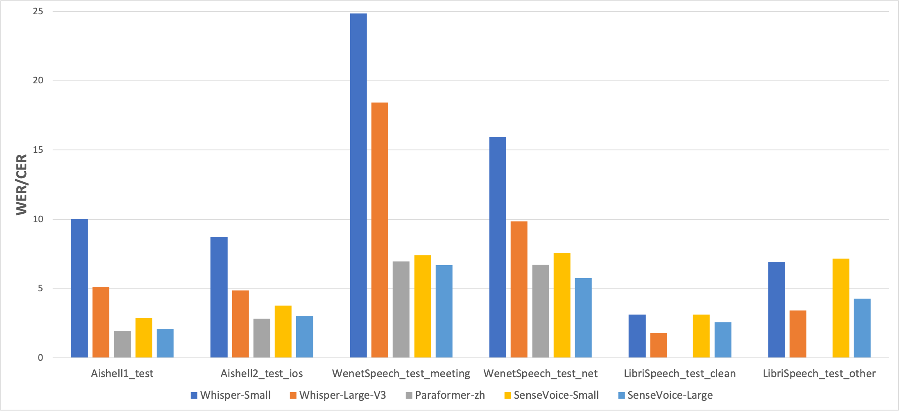
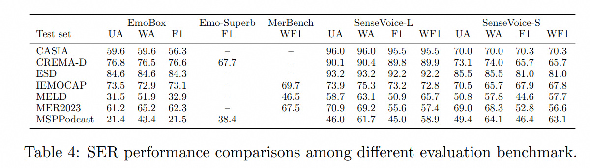
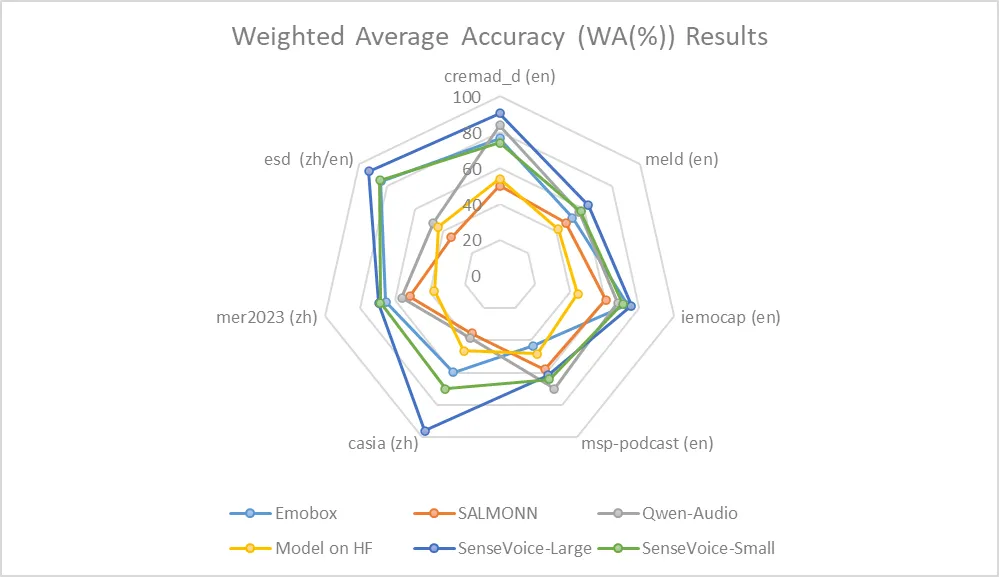
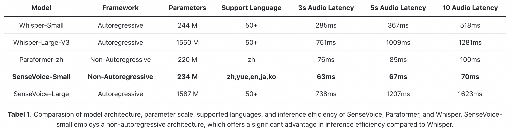

# SenseVoice

「简体中文」|「[English](./README.md)」|「[日本語](./README_ja.md)」

github [repo](https://github.com/FunAudioLLM/SenseVoice) : https://github.com/FunAudioLLM/SenseVoice

SenseVoice是具有音频理解能力的音频基础模型，包括语音识别（ASR）、语种识别（LID）、语音情感识别（SER）和声学事件分类（AEC）或声学事件检测（AED）。本项目提供SenseVoice模型的介绍以及在多个任务测试集上的benchmark，以及体验模型所需的环境安装的与推理方式。

<div align="center">  


[//]: # (<div align="center"> </div>)
 
<h4>
<a href="#What's New"> 文档主页 </a>
｜<a href="#核心功能"> 核心功能 </a>
</h4>
<h4>
<a href="#On Going"> 最新动态 </a>
｜<a href="#Benchmark"> Benchmark </a>
｜<a href="#环境安装"> 环境安装 </a>
｜<a href="#用法教程"> 用法教程 </a>
｜<a href="#联系我们"> 联系我们 </a>
</h4>

模型仓库：[modelscope](https://www.modelscope.cn/models/iic/SenseVoiceSmall)，[huggingface](https://huggingface.co/FunAudioLLM/SenseVoiceSmall)

在线体验：
[modelscope demo](https://www.modelscope.cn/studios/iic/SenseVoice), [huggingface space](https://huggingface.co/spaces/FunAudioLLM/SenseVoice)

</div>

<a name="核心功能"></a>
# 核心功能 🎯
**SenseVoice**专注于高精度多语言语音识别、情感辨识和音频事件检测
- **多语言识别：** 采用超过40万小时数据训练，支持超过50种语言，识别效果上优于Whisper模型。
- **富文本识别：** 
  - 具备优秀的情感识别，能够在测试数据上达到和超过目前最佳情感识别模型的效果。
  - 支持声音事件检测能力，支持音乐、掌声、笑声、哭声、咳嗽、喷嚏等多种常见人机交互事件进行检测。
- **高效推理：** SenseVoice-Small模型采用非自回归端到端框架，推理延迟极低，10s音频推理仅耗时70ms，15倍优于Whisper-Large。
- **微调定制：** 具备便捷的微调脚本与策略，方便用户根据业务场景修复长尾样本问题。
- **服务部署：** 具有完整的服务部署链路，支持多并发请求，支持客户端语言有，python、c++、html、java与c#等。

<a name="最新动态"></a>
# 最新动态 🔥
- 2024/7：新增加导出 [ONNX](https://github.com/FunAudioLLM/SenseVoice) 与 [libtorch](https://github.com/FunAudioLLM/SenseVoice) 功能，以及 python 版本 runtime：[funasr-onnx-0.4.0](https://pypi.org/project/funasr-onnx/)，[funasr-torch-0.1.1](https://pypi.org/project/funasr-torch/)
- 2024/7: [SenseVoice-Small](https://www.modelscope.cn/models/iic/SenseVoiceSmall) 多语言音频理解模型开源，支持中、粤、英、日、韩语的多语言语音识别，情感识别和事件检测能力，具有极低的推理延迟。。
- 2024/7: CosyVoice致力于自然语音生成，支持多语言、音色和情感控制，擅长多语言语音生成、零样本语音生成、跨语言语音克隆以及遵循指令的能力。[CosyVoice repo](https://github.com/FunAudioLLM/CosyVoice) and [CosyVoice 在线体验](https://www.modelscope.cn/studios/iic/CosyVoice-300M).
- 2024/7: [FunASR](https://github.com/modelscope/FunASR) 是一个基础语音识别工具包，提供多种功能，包括语音识别（ASR）、语音端点检测（VAD）、标点恢复、语言模型、说话人验证、说话人分离和多人对话语音识别等。

<a name="Benchmarks"></a>
# Benchmarks 📝

## 多语言语音识别

我们在开源基准数据集（包括 AISHELL-1、AISHELL-2、Wenetspeech、Librispeech和Common Voice）上比较了SenseVoice与Whisper的多语言语音识别性能和推理效率。在中文和粤语识别效果上，SenseVoice-Small模型具有明显的效果优势。

<div align="center">  

</div>

## 情感识别

由于目前缺乏被广泛使用的情感识别测试指标和方法，我们在多个测试集的多种指标进行测试，并与近年来Benchmark上的多个结果进行了全面的对比。所选取的测试集同时包含中文/英文两种语言以及表演、影视剧、自然对话等多种风格的数据，在不进行目标数据微调的前提下，SenseVoice能够在测试数据上达到和超过目前最佳情感识别模型的效果。

<div align="center">  

</div>

同时，我们还在测试集上对多个开源情感识别模型进行对比，结果表明，SenseVoice-Large模型可以在几乎所有数据上都达到了最佳效果，而SenseVoice-Small模型同样可以在多数数据集上取得超越其他开源模型的效果。

<div align="center">  

</div>

## 事件检测

尽管SenseVoice只在语音数据上进行训练，它仍然可以作为事件检测模型进行单独使用。我们在环境音分类ESC-50数据集上与目前业内广泛使用的BEATS与PANN模型的效果进行了对比。SenseVoice模型能够在这些任务上取得较好的效果，但受限于训练数据与训练方式，其事件分类效果专业的事件检测模型相比仍然有一定的差距。

<div align="center">  

</div>

## 推理效率

SenseVoice-small模型采用非自回归端到端架构，推理延迟极低。在参数量与Whisper-Small模型相当的情况下，比Whisper-Small模型推理速度快5倍，比Whisper-Large模型快15倍。同时SenseVoice-small模型在音频时长增加的情况下，推理耗时也无明显增加。

<div align="center">  

</div>

<a name="环境安装"></a>
# 安装依赖环境 🐍

```shell
pip install -r requirements.txt
```

<a name="用法教程"></a>
# 用法 🛠️

## 推理


### 使用funasr推理

支持任意格式音频输入，支持任意时长输入

```python
from funasr import AutoModel
from funasr.utils.postprocess_utils import rich_transcription_postprocess

model_dir = "FunAudioLLM/SenseVoiceSmall"


model = AutoModel(
    model=model_dir,
    trust_remote_code=True,
    vad_kwargs={"max_single_segment_time": 30000},
    device="cuda:0",
    hub="hf",
)

# en
res = model.generate(
    input=f"{model.model_path}/example/en.mp3",
    cache={},
    language="auto",  # "zn", "en", "yue", "ja", "ko", "nospeech"
    use_itn=True,
    batch_size_s=60,
    merge_vad=True,  #
    merge_length_s=15,
)
text = rich_transcription_postprocess(res[0]["text"])
print(text)
```
参数说明：
- `model_dir`：模型名称，或本地磁盘中的模型路径。
- `vad_model`：表示开启VAD，VAD的作用是将长音频切割成短音频，此时推理耗时包括了VAD与SenseVoice总耗时，为链路耗时，如果需要单独测试SenseVoice模型耗时，可以关闭VAD模型。
- `vad_kwargs`：表示VAD模型配置,`max_single_segment_time`: 表示`vad_model`最大切割音频时长, 单位是毫秒ms。
- `use_itn`：输出结果中是否包含标点与逆文本正则化。
- `batch_size_s` 表示采用动态batch，batch中总音频时长，单位为秒s。
- `merge_vad`：是否将 vad 模型切割的短音频碎片合成，合并后长度为`merge_length_s`，单位为秒s。

如果输入均为短音频（小于30s），并且需要批量化推理，为了加快推理效率，可以移除vad模型，并设置`batch_size`

```python
model = AutoModel(model=model_dir, trust_remote_code=True, device="cuda:0", hub="hf")

res = model.generate(
    input=f"{model.model_path}/example/en.mp3",
    cache={},
    language="auto", # "zn", "en", "yue", "ja", "ko", "nospeech"
    use_itn=True,
    batch_size=64, 
)
```

更多详细用法，请参考 [文档](https://github.com/modelscope/FunASR/blob/main/docs/tutorial/README.md)

### 直接推理

支持任意格式音频输入，输入音频时长限制在30s以下

```python
from model import SenseVoiceSmall
from funasr.utils.postprocess_utils import rich_transcription_postprocess

model_dir = "FunAudioLLM/SenseVoiceSmall"
m, kwargs = SenseVoiceSmall.from_pretrained(model=model_dir, device="cuda:0", hub="hf")
m.eval()

res = m.inference(
    data_in=f"{kwargs['model_path']}/example/en.mp3",
    language="auto", # "zn", "en", "yue", "ja", "ko", "nospeech"
    use_itn=False,
    **kwargs,
)

text = rich_transcription_postprocess(res[0][0]["text"])
print(text)
```


## 服务部署

Ref to [SenseVoice](https://github.com/FunAudioLLM/SenseVoice)

### 导出与测试（*进行中*）

Ref to [SenseVoice](https://github.com/FunAudioLLM/SenseVoice)

### 部署

Ref to [SenseVoice](https://github.com/FunAudioLLM/SenseVoice)

## 微调
Ref to [SenseVoice](https://github.com/FunAudioLLM/SenseVoice)


## WebUI

```shell
python webui.py
```

<div align="center"> </div>

# 联系我们

如果您在使用中遇到问题，可以直接在github页面提Issues。欢迎语音兴趣爱好者扫描以下的钉钉群二维码加入社区群，进行交流和讨论。

|                           FunAudioLLM                            |                          FunASR                          |
|:----------------------------------------------------------------:|:--------------------------------------------------------:|
| <div align="left"> | </div> |


